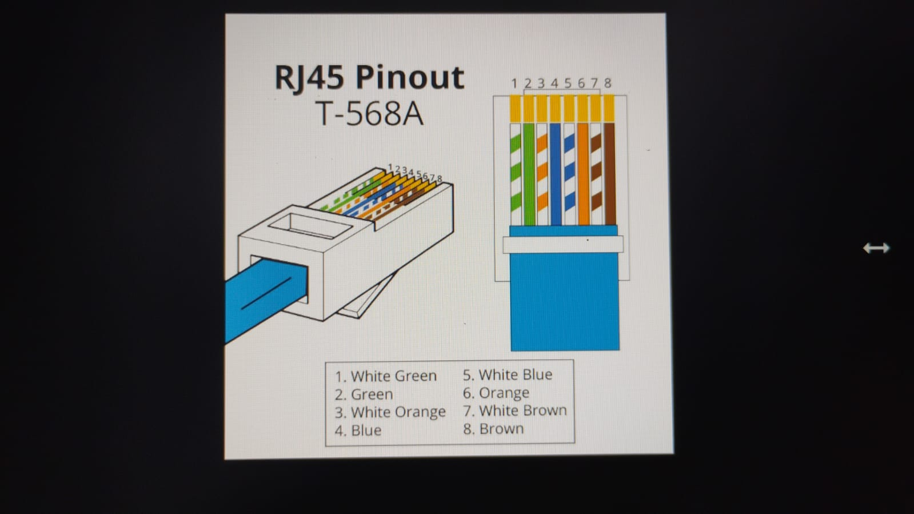

 ### Day - 1
**First of all we discussed about different types of companies.
### Product based companies
### Serviced based companies
.Then we learned about differences that are present in which like product based companies that have their own product but serviced based companies may or may not be have their own products but their primary business is service they works for other organization.
### Difference between Linux and Windows 

**Features           | Differences
_ _ _ _ _ _ _ _ _ _ _ _ _ _ _ _ _ _ _ _ _ _  _ _ _ _  _ _ _ _ _ _ _ _ _ _ _ _ _ _ _ _ _ _ _ _ _ _ _ _ _ _ _ _ _ _ _ _ _ 
 1: **Open Source**  | Linux are open source operating system but Windows are not open source operating system |
 
2: **Cost**         | Linux is free of cost but Windows are not free of cost|

3: **Preferrence**   | Linux is more preferred and used by hackers and Security Experts but Windows is not preferred by hackers|

4: **Security**      | Linux is More secure with better user control and  but Windows Less secure due to higher susceptibility to malware and viruses|

5: **Compatibility** | Linux can have two files with the same name but different cases but Windows are not|
### 2 : **Download Three Softwares
1: 
2: 
3: 
### After instalation 
1: Go to new .
2: Then enter name = **Ubuntu**.
3: Then select the path of Ubuntu in ISO image.
4: Give the required memory space.
5: Then enter username and passward.
### Error Occurance (Issue Faced):
. After powering up, display black screen with some error.
. 
### Error Solved (Problem Solved):
. Go to Setting > change the display graphic in VBoxVGA .
.

### Day - 2 ( Introduction of core component of OS and Basic Command)
1:**first of all today ,learened about Booting.
### What is Booting?
### Ans - Booting is the process of starting a computer and loading the operating system.
### Process of booting
1: The computer's BIOS or UEFI firmware intializes the hardware.

2: The BIOS/UEFI detects the boot device (eg. Hard drive or USB device)

3: The boot loader(eg. Windows boot Manager) is loaded into memory
### Types of booting
### COld boot/Hard BOOT
Starting a Computer froma  powered-off state.
### Warm Booting/Soft booting
. Restarting a computer without powering it off (eg. using the restart option)
### What is Kernel?
 Ans - The Kernel is a computer program that is core of computer's  operating system,Resposible for working with Hardware.
 
 . Example - It is like a Chef working in Kitchen that give you ,your order (output) but you can't see the chef.
 ### Shell ?
 Ans - Shell is a program that provides a way for users to interact with OS.
 ### Types of Shell
 1: Bash = (Most comman shell in linux)
 
 2:Sh = (original Shell)
 
 3:Zsh = (Unix Shell,used in terminal)
 
 4:fish = (it user-friendly from the start)
 
 ### Categories of Shell
 . Command line Shell : is a text based interface where you types commands to tell the computer to what to do by using keyboard'
 
 . Graphics Shell: ia user interface where you interact with computer using picture,icons,menu by using mouse.
 
### File System Structures
|Name      |    Features
_ _ _ _ _ _ _ _ _ _ _ _ _ _ _ _ _ _ _ _ _ _ _ _ _ _ _ _ _ _ _ _ _ _ _ _ _ _ _ _ _ _ _ _ _ _ _ 
| /        |  The slash / character denotes the root of the file system tree. (trunk of tree) |
 
| /home    |   contain all the personal directories of user|
 
| /bin     |   directories contains user executable file| 
 
| /lib     |   contain shell libraries|
 
| /boot    |   contain all the file that required for booting|
 
| /dev     |   contain hardware and development file|
 
| /media   |   mount points for remove media|

 |/mnt     |   temporary mounted filesystem
 
  |/opt     |   contain optional file|
 
| /var     |   contain variable data |
 ### Commands  
 ls (list) : contents of folder in which it runs
 
 pwd : print the current working dictionary
 
 touch : create file without content
 
 cat : create a file with content 
 
 
 cd : create a dictionary
 
 echo : print a text
 cp : copies of file from one location to other
 
 nano : edit the file from command line
 
 date : return current date
 
whoami :  return the current domain and user name

 whereis : find the location of file

 whatis : give short description of a command
 
 mkdir : make dictionary
 
 rmdir : remove dictionary
 

 ### DAY - 3
### Bare Metal installation 

1 Bare metal installation directly using USB (pen drive)

2. Direct installation in ccomputer hardware

### Partitioning schemes
1. divide a Hard Disk into separate division.

2. Each Section acts like a independent disk.

### Types
     /   \
    (MBR) (GBT)     
|______________________|      |GUID Partition table|

| Older,Used with BIOS|      |Support 128 + Partition|     

|Less flexible|              |MOre  flexible |      

|supports upto 2 TB|         |Newer Used with UEFI| 

|Max 4 Primary Partition|    |Works with disks>2 TB |                   

### File and Dictionary Permission
       |___________|
       |  Users    |
       |___________|
       /      |     \
    Owner    Group   Other

       |____________|            
       | Permission |
       |____________|            
       /     |       \
    read   Write     Execute

 ### Types of command
. change mod (chmod): To change the file permission.
ge b
. Syntax - chmod + x filename.sh (give permission to run the script)

. chmod 444: chmod 444 myself.sh  ( permission to read only for everywhere)
. 

. chmod 644 (Permission to only owner)

 2. chown: (Change the owner and group owner of file directories)

. Syntax: chown user:group file .txt
. 

. Result 

. Permission: only the root and the current owner change the ownership using owner. change the group assoiciated with file and dictionary.

### Redirection
. Allow you to change input or ouput of command.

. Echo hello > day3.txt

. Redirect the message from hello to day3.txt 

. Operations - >(standard  output), >> < (standard input)

### Pipes
. Take output from one command and pass it to another command.

. Particular file in folder.

. Example: You have many fies in folder but you want only file that ends with .sh

### Types 

. pipes are two types

1 unnamed pipes - created using pipe()

2. Named pipes - special file created with mkfifo and can be used for releated communication

### Shell Program

1. Use of Variable

 input

output

 ### Multiplication of any number

. input

. Output

### Comparision of two numbers

. input

. Output

### DAY - 4 

### File Compression Through Command

File compression is the process of reducing the size of a file or group of files by encoding the data more efficiently. This is done to save storage space, reduce transmission time over the internet, and make file management easier.

### Key Points:
### Purpose

. Save Storage space: Save space, speed up file transfer, or organize multiple files.

 . Faster Transmission: Smaller files transfer more quickly over networs , reducing upload and download times.

### GZIP (GNU Zip)

. GZip is a tool that makes files smaller so they take up less space and are faster to send or download,without reducing its size without losing any data.. It creates files with a .gz ending and is mostly used on Linux system.

Syntax: gzip filename.txt

. This command will compress and Creates a new file filename.txt.gz and deletes the original filename . 
### Decompress a file:

. To decompose the file, can use  gunzip command which is equivalent.

. gunzip filename.txt.gz

This will decompose the file  remove the .gz extension, restoring the original file.

### Keep the original file

. To compress the file and keep the original ,use -k option.

. gzip -k file.txt

. This will create a file without without deleting the original file.

### Wildcards

🔹 Definition of Wildcards:
Wildcards in Linux are special characters used in the command line to represent one or more characters in filenames or directory names. They allow users to work with multiple files at once without typing each name individually.

🔹 Example:  ls *.txt

✅ Common Commands with Wildcards
rm *.log               # Remove all .log files

cp *.jpg images/       # Copy all jpg files to images folder

mv report?.txt old/    # Move report1.txt, report2.txt, etc., to old

| Wildcard  | Description                              | Example          |
| --------- | ---------------------------------------- | ---------------- |
| `*`       | Zero or more characters                  | `*.txt`          |
| `?`       | Exactly one character                    | `file?.txt`      |
| `[...]`   | Any one character from set/range         | `file[1-3].txt`  |
| `[!...]`  | Any one character **not** in set         | `file[!0-9].txt` |
| `{a,b,c}` | Matches any listed string (brace expand) | `file{1,2}.txt`  |
| `{1..5}`  | Range expansion                          | `file{1..5}.txt` |

### Asssignment (Question)

### Escaping Character in linux (Shell)

In Linux, escaping characters means preventing the shell from interpreting special characters. This is essential when dealing with wildcards, variables, spaces, quotes, and other symbols.

###  Why Escape Characters?
Because the shell interprets certain characters specially:

*, ?, |, &, <, >, $, ", ', \, etc.

Escaping tells the shell: "Treat this as a literal character, not a command or pattern.

### Comman Escape Method

| Escape Method | Effect                           | Example                       |
| ------------- | -------------------------------- | ----------------------------- |
| `\`           | Escapes next character           | `echo \$HOME` → `$HOME`       |
| `'...'`       | Everything literal               | `'*.txt'` → `*.txt`           |
| `"..."`       | Allows vars, escapes most others | `"Hello $USER"`               |
| `\` (newline) | Continue command on next line    | `echo "Hello \` → next line\` |

### Example

🔹 1. Escaping a Space in a Filename

. touch MyFile.txt 

ls MyFile.txt       

🔹 2. Escaping a Dollar Sign ($)

. echo \$HOME     

### Quoting in linux

Quoting in Linux (specifically in the shell, like bash) is essential for controlling how the shell interprets special characters like spaces, $, *, &, etc. There are three main types of quoting

1. Single Quotes (')

Purpose: Preserves the literal value of every character inside the quotes.

Example: input

echo 'This is $HOME and $(ls)' 

output : This is $HOME and $(ls)

2. Double Quotes (")

Purpose: Preserves most characters literally except $, `, \, and ! (in some shells).

3. Backslash (\)

Purpose: Escapes a single character, telling the shell to treat it literally.

Input : echo \$HOME

Output: $HOME

### Practical Comperission

| Expression            | What it does                   |
| --------------------- | ------------------------------ |
| `'Hello $USER'`       | Prints literal string          |
| `"Hello $USER"`       | Expands variable               |
| `echo Hello\ World`   | Escapes the space character    |
| `echo "Files: $(ls)"` | Substitutes the output of `ls` |

### Hardware
### Defination: Hardware refers to the physical components of a computer or any electronic system. These are the tangible parts you can touch and see, as opposed to software, which consists of programs and data.

### What is Computer Hardware?

It includes everything from the central processing unit (CPU) inside the computer to the monitor, keyboard, mouse, and storage devices.

Essentially, computer hardware is the machinery that runs software and lets you interact with the computer.

### Basic computer Hardware Components

| Component                   | What It Does                                                    |
| --------------------------- | --------------------------------------------------------------- |
| **CPU (Processor)**         | The brain of the computer, processes instructions and data      |
| **Motherboard**             | The main circuit board connecting all components                |
| **RAM (Memory)**            | Temporary storage that the CPU uses to quickly access data      |
| **Hard Drive / SSD**        | Long-term storage for files, programs, and the operating system |
| **Power Supply Unit (PSU)** | Converts electricity to power the computer                      |
| **Input Devices**           | Devices like keyboard, mouse, scanner used to input data        |
| **Output Devices**          | Devices like monitor, printer used to display or produce output |
| **Graphics Card (GPU)**     | Handles images, video, and graphics processing                  |

### Motherboard

### What is a Motherboard?

. It’s a large flat board inside the computer that connects and allows communication between all the other hardware components.

. It holds the CPU, memory (RAM), storage connections, and expansion cards.

. It also provides connectors for input/output devices like USB ports, audio jacks, and network cables.

### Key Functions of a Motherboard:

. Connects all parts: CPU, RAM, hard drives, graphics card, and other devices.

. Distributes power: Supplies power to different components via the power supply.

. Communication hub: Allows different parts to communicate and work together.

. Expansion slots: Lets you add extra components like graphic cards or sound cards.

### Components on a Motherboard:

1 CPU Socket:

The slot where the processor (CPU) is installed.

It connects the CPU to the rest of the system.

2 RAM Slots (Memory Slots):

Slots where RAM (memory) modules are inserted.

These provide the computer with fast, temporary memory.

3 Chipset:

Controls communication between the CPU, RAM, storage devices, and peripherals.

Often divided into Northbridge (handles high-speed devices like CPU and RAM) and Southbridge (handles slower peripherals like USB, audio).

4 Power Connectors:

Connect the motherboard to the power supply unit (PSU) to provide power.

Usually includes a large 24-pin connector and additional CPU power connectors.

5 PCI / PCI Express (PCIe) Slots:

Expansion slots for adding hardware like graphics cards, sound cards, or network cards.

6 Storage Connectors (SATA Ports):

Connectors for hard drives (HDDs), solid-state drives (SSDs), and optical drives.

7 BIOS / UEFI Chip: 

Firmware chip that helps start the computer and manage hardware before the operating system loads.

8 Input/Output (I/O) Ports:

External connectors on the back of the motherboard for devices like:

9 USB devices:

Ethernet (network) cables

Audio jacks

Video outputs (HDMI, DisplayPort)

CMOS Battery

A small battery that powers the motherboard’s memory for BIOS settings even when the computer is off.

### Power Supply in Hardware

A power supply unit (PSU) is a crucial hardware component that provides electrical power to other components in an electronic system or computer.

### Key Functions:

1. Convert AC to DC: Most hardware devices run on DC power, but the wall outlet provides AC. The PSU converts this AC power into stable DC voltages.

2. Regulate Voltage: It ensures the voltage is constant and within safe limits for the hardware.

3. Distribute Power: Supplies different voltages (e.g., +12V, +5V, +3.3V) to various hardware components like the CPU, motherboard, drives, 

### Cache Memory:

Cache memory is a small, high-speed memory located close to or inside the CPU (Central Processing Unit). It stores frequently used data and instructions so the CPU can access them faster than fetching from the main RAM (which is slower in comparison).

🔍 Why Cache Memory is Important: 

. CPU is much faster than RAM — so if the CPU had to wait for data from RAM every time, it would slow down.

. Cache stores recently used or frequently accessed data.

. Reduces latency and increases processing speed.

⚙️ How It Works :
. CPU requests data.

. Checks L1 → if found, this is a cache hit (very fast).

. If not in L1, checks L2, then L3.

. If not in any cache → fetches from main RAM (slowest — cache miss).

. Once fetched, data is stored in the cache for future use.

### Difference between Cache and RAM memory

| Feature            | **Cache Memory**                                                     | **RAM (Main Memory)**                        |
| ------------------ | -------------------------------------------------------------------- | -------------------------------------------- |
| **Location**       | Inside or very close to the CPU                                      | On the motherboard, connected to the CPU     |
| **Speed**          | Extremely fast (faster than RAM)                                     | Fast, but slower than cache                  |
| **Size**           | Very small (KBs to tens of MBs)                                      | Much larger (GBs)                            |
| **Cost per MB**    | High                                                                 | Lower                                        |
| **Type of Memory** | SRAM (Static RAM)                                                    | DRAM (Dynamic RAM)                           |
| **Purpose**        | Temporarily stores frequently accessed data/instructions for the CPU | Stores all active programs and data in use   |
| **Access by CPU**  | Direct and automatic                                                 | Requires memory controller to access         |
| **Volatility**     | Volatile (data lost when power is off)                               | Volatile (same)                              |
| **Managed by**     | Hardware (CPU decides what goes in cache)                            | Operating System (allocates RAM to programs) |
| **Example Size**   | L1: 64 KB, L2: 512 KB, L3: 8 MB                                      | 4 GB, 8 GB, 16 GB, etc.                      |

 ### Difference between RAM and Harddisk

 | Feature         | **RAM (Random Access Memory)**                                    | **Hard Disk (HDD/SSD)**                                             |
| --------------- | ----------------------------------------------------------------- | ------------------------------------------------------------------- |
| **Function**    | Temporary memory used by the system to run programs and processes | Permanent storage for files, applications, and the operating system |
| **Volatility**  | Volatile – data is lost when the computer is turned off           | Non-volatile – data remains even when the power is off              |
| **Speed**       | Very fast (nanoseconds)                                           | Slower (milliseconds), though SSDs are faster than HDDs             |
| **Capacity**    | Typically 4GB to 64GB (depends on usage)                          | Typically 256GB to several terabytes                                |
| **Usage**       | Acts as a workspace for the CPU to process data                   | Stores data long-term, like documents, software, and system files   |
| **Cost per GB** | More expensive                                                    | Less expensive                                                      |
  
### DAY - 5

### Comman Issues and problems in pc and their Solutions.

🎮 What Is a GPU?
A GPU is responsible for rendering images, video, and animations. It’s essential for gaming, video editing, 3D rendering, and sometimes AI/machine learning tasks.

⚠️ Common GPU Problems and Issues
1. No Display / Black Screen
Causes:

Improper GPU seating in the PCIe slot

Faulty GPU or power supply

Dead HDMI/DisplayPort cable

Solutions:

Reseat the GPU

Try a different output port or cable

Test on another monitor

2. Screen Artifacts / Glitches
Causes:

Overheating

Overclocking gone wrong

Driver or VRAM issues

Solutions:

Revert overclock settings

Clean dust from GPU

Update or reinstall GPU drivers

3. Driver Crashes / “Display Driver Stopped Responding”
Causes:

Incompatible or outdated drivers

System instability

Solutions:

Use DDU (Display Driver Uninstaller) to remove old drivers

Reinstall the latest drivers from NVIDIA, AMD, or Intel

 ### PCU
 🎮 What Is a GPU?
A GPU is responsible for rendering images, video, and animations. It’s essential for gaming, video editing, 3D rendering, and sometimes AI/machine learning tasks.

⚠️ Common GPU Problems and Issues
1. No Display / Black Screen
Causes:

Improper GPU seating in the PCIe slot

Faulty GPU or power supply

Dead HDMI/DisplayPort cable

Solutions:

Reseat the GPU

Try a different output port or cable

Test on another monitor

2. Screen Artifacts / Glitches
Causes:

Overheating

Overclocking gone wrong

Driver or VRAM issues

Solutions:

Revert overclock settings

Clean dust from GPU

Update or reinstall GPU drivers

3. Driver Crashes / “Display Driver Stopped Responding”
Causes:

Incompatible or outdated drivers

System instability

Solutions:

Use DDU (Display Driver Uninstaller) to remove old driver.

### PCU (Personal Computer Unit)

A Personal Computer Unit refers to the complete physical system of a computer, which includes all the essential hardware components needed to process data, run software, and perform computing tasks for individual users.

### Installation & Hard Disk Preparation:
Partitioning: The first step of Partitinong is to organize the hard disk into:

Primary (C: Drive):Where the Operating System (Windows/Linux/Unix) is installed.

Avoid storing personal/important files in C:
If Windows crashes, files in D:, E:, F: are safer and can often be recovered.

Logical Drives (D:, E:, F:): Used for pictures, videos, documents, etc.

Speed slow (Causes & Fixes):
Desktop: Files should be on drive. By default files on desktop are stored on C drive. As OS system is installed in C: file, its recomended to not put many folders in Desktop. Move them into drives.

-Taskbar: keep taskbar clean . close the apps which are not in use.

-Bookmarks: Booksmarks also slows down the speed . because system keep running them in background .

-Temporary files : The files that get created by default during web browsing are temporary files . These can also be the cause of slower performance.

while web browsing some websites ask permmision to accept cookies by which these temporary files are created.

-Malvares : keep your system updated and scan for viruses every month atleast.

### Concept of Optimisation:
Optimization means making something as good, efficient, or effective as possible.

In the computer world, it often refers to:

Speeding up software or hardware so it runs faster or uses fewer resources

-Improving algorithms to solve problems more efficiently

-Reducing energy use in devices or systems

Defragmentation is the process of reorganizing fragmented data on a hard disk so that related pieces are stored close together. This improves file access speed and overall system performance on traditional HDDs. It’s not needed for SSDs, which use a different method called TRIM.

DRIVERS:
Drivers are software that let the operating system communicate with hardware like printers, keyboards, or graphics cards. Without them, hardware won’t work properly.

ISSUES FACED WHILE USING PRINTER:
Here’s a compact list of common printer issues and how to fix them:

🖨️ Common Printer Issues & Solutions
1. Printer Not Printing
Possible Causes:

Printer not set as default

Print queue stuck

Connectivity issue (USB/Wi-Fi)

Solutions:

Set as default printer (Settings > Devices > Printers)

Restart the Print Spooler service:

Run → services.msc → Print Spooler → Restart

Cancel all print jobs and try again

Reconnect printer (USB/Wi-Fi) or restart router

2. Printer Offline / Not Detected
Possible Causes:

Disconnected cable or unstable Wi-Fi

Power saving mode

Incorrect printer port

Solutions:

Reconnect or replace USB/Wi-Fi cable

Restart both PC and printer

Uncheck “Use Printer Offline” in printer settings

Update or reinstall printer drivers

3. Paper Jam
Possible Causes:

Misaligned or overloaded paper tray

Torn or crumpled paper

Solutions:

Open all access doors and gently remove jammed paper

Check for tiny pieces stuck inside

Reload paper properly and align guides

4. Poor Print Quality
Symptoms:

Streaks, faded text, blurry or smudged prints

Solutions:

Clean print heads (via printer software)

Align cartridges

Replace low or dried-out ink/toner

Use correct paper type and print settings

Blue Screen of Death (BSOD):
It is used to indicate a system crash, in which the operating system reaches a critical condition where it can no longer operate safely.

Common Causes of BSOD:

Hardware Failures:
Faulty RAM, hard disk, or other internal components
Driver Issues:
Outdated, incompatible, or corrupted device drivers
Corrupted System Files:
System file corruption due to improper shutdowns, malware, or failed updates
Overheating or Power Issues:
Inadequate cooling or power supply malfunctions
System Crash Analysis:
After a BSOD, Windows creates a dump file that records what happened before the crash.

Tools for Analysis:
Event Viewer:
Windows tool to check detailed system and crash logs.
WinDbg:
Microsoft Debugging Tool for analyzing dump files |
BIOS/UEFI Settings and POST Errors:
|BIOS	                     |  UEFI                                   |
|------------------------------------------------------------------- |
|Basic Input/Output System | 	Unified Extensible Firmware Interface  |

|Older firmware standard   |	 Modern replacement for BIOS            |

|Keyboard-only navigation 	| Supports mouse and GUI                  |

|Stored in ROM chip       	| Stored in flash memory                  |

### Accessing BIOS/UEFI Settings
Press F2, F10, DEL, or ESC continously during startup (key depends on manufacturer).

From here, you can:

Change boot order

Enable/disable hardware components

View system info

Reset settings to default (if needed)

### Day - 6
### Safe mode:
Safe Mode is a diagnostic mode in Windows that starts the computer with a minimal set of drivers and services, which makes it easier to find and remove harmful malware and viruses without activating them.

### Types of safe mode:

Safe Mode:
Used to diagnose and fix basic system issues.

### Safe Mode with Networking:
Includes network drivers and services. Allowing access to the internet or network drives for troubleshooting.

### Safe Mode with Command Prompt:
Loads a minimal environment with Command Prompt instead of the normal desktop interface

### Recovery tools:
The Recovery Drive utility in Windows is a tool designed to back up essential system files needed to restore a PC to its original state.
It fixes problems that prevent Windows from booting.
Rolls back system files and settings to an earlier point in time without affecting personal files.
### OS repair:
It is used when the OS fails to boot or behaves abnormally.

### Use repair commands:

sfc /scannow – Scans and restores system files.
DISM /Online /Cleanup-Image /RestoreHealth – Repairs corrupted Windows images.

Bootable USB for repair and system reinstall.

### Virus/Malware Symptoms:
Slow performance

Frequent crashes or freezes

Slow startup

Unexplained files or folders disappearing

### Unusual network activity:
Malware can send or receive data, causing increased network activity, especially when your device is idle.

Increased data usage:

Malware can consume more data than usual, especially if it's sending or receiving large amounts of information.
Browser-Related Symptoms:
Unwanted pop-up ads
Browser redirects
### Basic removal:
Enter safe mode.

Run Antivirus scan

Delete suspicious Programs via Control Panel.

Clear Temp files.

Reset Web browser setting.

Check startup Programs

Update OS and antivirus.

### Where to Keep Windows Backups?
Backups are essential for recovery in case of OS failure or data loss.

External Drive: Recommended option for offline, safe backup storage.

Separate Internal Drive (e.g., D:, E:): Better than storing on the system drive (C:), but vulnerable if the whole disk fails.

Cloud Storage: Services like Google Drive, OneDrive, or Dropbox allow automatic syncing and access from anywhere.

### Modern Internet Transmission (Wired Connections):
RJ45:

RJ45 stands for Registered Jack 45.

It is a standard connector used for Ethernet networking cables.

RJ45 connectors are typically used to connect computers, routers, switches, and other networking devices.

It has 8 pins (8P8C – 8 position, 8 contact) and connects twisted-pair cables like Cat5e, Cat6, Cat6a.

Commonly used for LAN (Local Area Network) connections.

Cat5, Cat6, Cat6e: Categories of twisted-pair cables used in wired networks, offering various speeds and shielding levels.

### How to Make a RJ‐45 Cable:
Strip the cable to remove 1 inch of the outer sheath.

Untwist and straighten the wires inside of the cable

Arrange the wires into the right order.
Pin Number	Wire Color (T568B)	Signal

1	White Orange	Transmit + (TX+)

2	Orange	Transmit – (TX–)

3	White Green	Receive + (RX+)

4	Blue	Unused / PoE +

5	White Blue	Unused / PoE +

6	Green	Receive – (RX–)

7	White Brown	Unused / PoE –

8	Brown	Unused / PoE –

Trim the wires into an even line 1⁄2 inch (13 mm) from sheathing

Insert the wires into the RJ-45 connector.

Stick the connector into the crimping part of the tool and squeeze twice.

Remove the cable from the tool and check that all of the pins are down & test the cable.

### Day - 7
### Networking Basics
### Network Definition:
Any time two or more hosts are connected and can communicate, you have a network.

### 1. Hosts and Traffic:
Host: Host is any device which sends or receive data traffic over a network. While often a computer, it can also include other networked devices like smartphones, tablets, and IoT (Internet of Things) devices.
Client: Client is a host that initiates requests for services from another device on the network.

Server: Server is a computer designed to respond to requests from clients. It "serves" the requested data or services to the user.

Traffic: It refers to the data that is transmitted between devices on a network. This can include anything from web pages and emails to video streams and sensor data from IoT devices.
image

### 2. IP Address (Internet Protocol Address):

An IP address is a unique numerical identifier assigned to every device connected to a computer network that uses the Internet Protocol for communication.

### Protocol: Protocol is a set of rules governing how data is formatted, transmitted, and received between devices.

### Properties:
Unique: Each device on a network must have a unique IP address.

Universal: IP addresses are a globally recognized standard for network communication.
### Types:
.  Public IP Address: Used on the internet, these addresses are globally unique and routable.

. Private IP Address: Used within private networks (e.g., home or school networks), these addresses are not directly routable on the internet.

Dynamic Nature: IP address can change over time, especially for devices on dynamic IP assignments. However, its fundamental properties (uniqueness and universality) remain constant.
### 3. IPv4 (Internet Protocol Version 4):
IPv4 is the fourth version of the Internet Protocol.

Length: 32 bits long.
Address Space: Can theoretically support 2^32 unique addresses.

Notation: Represented in dotted-decimal format, consisting of four octets (groups of 8 bits) separated by dots. Each octet can range from 0 to 255.
Example: 192.168.1.1
### Address Structure:

Network ID (Prefix): Defines the network segment to which the device belongs. This part is common for all devices within the same network.

Host ID (Suffix): Uniquely identifies a specific device (host) within that network segment.

Example: An international phone number where the country code represent network and the phone number represents the "host."

### 4. IPv6 (Internet Protocol Version 6)
IPv6 is the latest version of the Internet Protocol, designed to address the limitations of IPv4, primarily the exhaustion of available addresses.

. Length: 128 bits long.
### Address Space: Can support a vastly larger number of addresses, approximately 2^128

.Notation: Represented in hexadecimal, often with colons separating groups of 16 bits.

### 5. Classful Addressing (IPv4)
It is used to categorizing IP addresses into different classes based on the range of their first octet. There are five classes: A, B, C, D, and E.

Class	Starting Bits	IP Range	Length of Network (Bits)	Reseved bits	Number of Networks	Number of Hosts	Default Subnet Mask	Purpose

| Class | First Octet Range | Starting Bits | Default Subnet Mask | Network Size | Usage                 |
| ----- | ----------------- | ------------- | ------------------- | ------------ | --------------------- |
| **A** | 1 – 126           | 0xxxxxxx      | 255.0.0.0           | Very Large   | Large networks        |
| **B** | 128 – 191         | 10xxxxxx      | 255.255.0.0         | Medium       | Medium networks       |
| **C** | 192 – 223         | 110xxxxx      | 255.255.255.0       | Small        | Small networks        |
| **D** | 224 – 239         | 1110xxxx      | N/A (Multicast)     | N/A          | Multicast             |
| **E** | 240 – 255         | 1111xxxx      | N/A (Experimental)  | N/A          | Reserved/Experimental |

Note: As the prefix (network ID) increases, the number of available host IDs decreases

### 6. Broadcast vs. Multicast vs. Unicast
| Feature     | **Unicast**    | **Broadcast**                 | **Multicast**                   |
| ----------- | -------------- | ----------------------------- | ------------------------------- |
| Type        | One-to-One     | One-to-All                    | One-to-Many (Group)             |
| IP Range    | Normal IPs     | `255.255.255.255` or subnet   | `224.0.0.0` – `239.255.255.255` |
| Receiver    | Single device  | All devices in the network    | Devices in multicast group      |
| Example Use | Web browsing   | ARP request                   | Live video conferencing         |
| Efficiency  | Very Efficient | Inefficient in large networks | Efficient for groups            |

### 7. Subnetting:
Dividing a large network into smaller, more manageable sub-networks. It helps to utilize the network bandwidth in more intelligent way.

Bandwidth: Capacity of network; data transmission rate (e.g., Mbps). Should be maximum.

Latency: Delay in data transmission. Should be minimum.

Host Bits: Denoted by '0's in subnet mask.

Network IP: First IP of a subnet (cannot be assigned to host).

Broadcast IP: Last IP of a subnet (cannot be assigned to host).

### Some other small concepts:
### MAC (Media Access Control Address)

### Nature: A unique, 12-character hexadecimal (alphanumeric) attribute used to identify individual electronic devices on a network.

### Distinction from IP Address:

MAC Address: Identifies the physical location of a device within a local network. It's like your permanent home address. The manufacturer provides it.
IP Address: Signifies the device's global or internet-accessible identity. It's more like a temporary vacation rental address, changing depending on your network connection.

### DNS (Domain Name System):

It is a naming system for computers, service etc connected to the Internet or a private network. It translates domain names (www.google.com) into machine-readable IP addresses (172.217.160.142).

### Default Gateway:
Its a device (typically a router) that acts as a pathway for data to leave a local network and reach other networks, including the internet.

### CIDR (Classless Inter-Domain Routing):
Modern method for IP allocation and routing, replacing classful addressing with more flexible network sizing (e.g., /24).
### Types of Cables
Twisted Pair:
Types: Shielded (STP) and Unshielded (UTP).
Use: LANs (Ethernet).

Coaxial:
Use: TV networks, older computer networks.

Fiber-Optic:
Use: High-speed networks, long distances (most commonly used today).

.### Numericals:
For 205.150.65.0/26. Find:
Subset mask

Number of subsets

Number of hosts

Network IP

Broadcast IP.

### Answer:
Here /26 is CIDR Class: Class C.

Subnet Mask: 255.255.255.192

In binary: 11111111.11111111.11111111.11000000

.This means 26 bits are used for the network.

Convering 11000000 to decimal = 2^7 + 2^6 = 192
SO Subset mask is: 255.255.255.192

### Number of Subnets:

26 network bits - 24 default network bits = 2 subnet bits
Number of subnets = 2^subnet bits = 2^2 = 4
### 3 Number of Hosts
Host ID Bits: 32 - 26 = 6
Number of hosts = 2^host bits − 2 = 2^6 − 2 = 64 − 2 = 62

### Network IP:
Given IP AND (AND operation) Subset mask:
205.105.65.0

### Broadcast IP:
As maximum number of hosts are 62:
205.105.65.63

### Day 8
### Networking Commands and Concepts

### DHCP (Dynamic Host Configuration Protocol):
It is a network protocol that automates IP address assignment to devices on a network.
### Network Commands:
ping

. Meaning (Simple): "Hey, are you there?" It's used to check if another computer, server, or website is currently online and reachable from your PC.

. Technical Meaning: ping sends ICMP (Internet Control Message Protocol) Echo Request packets to a target host.

If a reply is received, the host is "alive".

Otherwise, its blocked.

### Syntax: ping website_address

Example: ping google.com

To Exit: Press Ctrl + C in the command prompt/terminal.

### Loopback Address (127.0.0.1):

This IP always refers to "yourself" – your own computer.

It's used to test the network configuration of your local PC.

Example: Like sending a letter to your own house to test if your mailbox works.

### traceroute (Windows: tracert)
It shows the exact path your data takes from your computer to a website or server, revealing every "hop" (router) along the way. Each hop represents a router that the data packet passes through.

Syntax: traceroute <hostname_or_IP_address> (on macOS/Linux) or tracert <hostname_or_IP_address> (on Windows)

*** (Asterisks) in Output: It indicates that the router at that hop did not reply.
ipconfig (Windows) / ifconfig (macOS/Linux)

### ipconfig (Windows):

Shows the IP address, subnet mask, default gateway, DNS servers, and other network settings that your Windows computer is currently using.
### ifconfig (macOS/Linux):

Provides:
|Term	|Represents|
-----------------
|inet	|IP address|
|netmask|	Network range|
|lo0	|Loopback|
|broadcast	|Address used to send messages to all devices.|
### Ethernet:
It is used to connect devices with a physical cable so that they can communicate or access.

### How it Works:
Plug one end of an Ethernet cable into your PC's network port.

Plug the other end of the cable into a modem or router.

Your PC can now communicate over the network and access the internet.

### Ethernert vs wifi

| Feature          | **Ethernet**                             | **Wi-Fi**                                          |
| ---------------- | ---------------------------------------- | -------------------------------------------------- |
| **Type**         | Wired connection                         | Wireless connection                                |
| **Speed**        | Generally faster (up to 10 Gbps or more) | Slower than Ethernet (typical: 100 Mbps – 1 Gbps)  |
| **Stability**    | Very stable (less interference)          | May face interference from walls, signals, etc.    |
| **Security**     | More secure (physical access needed)     | Less secure (can be hacked if not encrypted)       |
| **Mobility**     | Limited (requires cables)                | High mobility (can move freely within range)       |
| **Setup**        | Requires cables and ports                | Easier to set up, no cables needed                 |
| **Interference** | Not affected by radio signals            | Can be affected by other devices (microwave, etc.) |
| **Cost**         | May need extra cabling or switches       | Cheaper and simpler for small setups               |
| **Use Case**     | Offices, gaming, large data transfer     | Homes, mobile devices, casual browsing             |

### compareision of networks

| Feature                 | **PAN** (Personal Area Network)   | **LAN** (Local Area Network)        | **MAN** (Metropolitan Area Network) | **WAN** (Wide Area Network)         |
| ----------------------- | --------------------------------- | ----------------------------------- | ----------------------------------- | ----------------------------------- |
| **Full Form**           | Personal Area Network             | Local Area Network                  | Metropolitan Area Network           | Wide Area Network                   |
| **Coverage Area**       | A few meters (e.g., room, person) | Small area (home, office, building) | City-wide                           | Large area (country, globe)         |
| **Ownership**           | Owned by a single person          | Usually private (home or company)   | Can be private or public            | Usually public or telecom companies |
| **Examples**            | Bluetooth, USB tethering          | Wi-Fi in home, office Ethernet      | Cable TV network, city broadband    | Internet, bank networks             |
| **Speed**               | Low to moderate (10 Mbps–50 Mbps) | High speed (up to 1 Gbps or more)   | Moderate (up to 100 Mbps)           | Varies (100 Mbps – multi-Gbps)      |
| **Security**            | High (due to proximity)           | Moderate to high                    | Moderate                            | Low (more vulnerable to attacks)    |
| **Setup Cost**          | Very Low                          | Low to Medium                       | High                                | Very High                           |
| **Examples of Devices** | Smartphones, wearables            | PCs, routers, switches              | Routers, fiber lines                | Satellites, fiber links, routers    |

### Day 9
### Introduction to HTML & Web Basics
### HTML:
HTML stands for HyperText Markup Language.

It is the standard markup language for creating web pages and web applications.

HTML defines the structure and content of a web page.

### How browsers render it:
The browser reads the HTML file line by line.

It builds the DOM (Document Object Model) — a tree-like structure of the page.

The browser then displays the structured content visually based on HTML + CSS.

### Structure of an HTML Document
<!DOCTYPE> declaration defines that this document is an HTML5 document

<html> element is the root element of an HTML page
 
<head> element contains meta information about the HTML page
 
<title> element specifies a title for the HTML page (which is shown in the browser's title bar or in the page's tab)
 
<body> element defines the document's body, and is a container for all the visible contents, such as headings, paragraphs, images, hyperlinks, tables, lists, etc.
 
<h1> element defines a large heading
 

 element defines a paragraph

### Day 10

### 🌐 Introduction to HTML & Web Basics
### ✅ What is HTML?
HTML (HyperText Markup Language) is the standard language used to create web pages. It structures content using tags that the browser can interpret.

### 🔖 Common HTML Tags
1. Headings (<h1> to <h6>)
Used to define titles and subheadings.
<h1> is the largest, <h6> is the smallest. 

 <h1>Main Title</h1>
<h2>Subheading</h2>

### 2. Paragraph (
)
Represents a block of text.

This is a paragraph of text.

### 3. Lists
🔸 Unordered List (<ul>) – Bullet Points
<ul>
  <li>Apple</li>
  <li>Banana</li>
</ul>

###🔸 Ordered List (<ol>) – Numbered
<ol>
  <li>First Step</li>
  <li>Second Step</li>
</ol>

###  4. Links (<a>)
Used to create clickable hyperlinks.
href attribute defines the URL.

<a href="https://www.google.com">Visit Google</a>

### 5. Images ()
Used to display images on a web page.
src specifies the image path, alt gives alternative text.

### Using above HTML tags

### Day 11

### 📘 1. Forms and Input Types in HTML
### 🔹 What is a Form?
An HTML form is used to collect user input and send it to a server for processing. It is defined using the <form> tag.

<form action="/submit" method="post">
  <!-- input elements go here -->
</form>

### HTML Form Method
| Feature         | **GET**          | **POST**                          |
| --------------- | ---------------- | --------------------------------- |
| Data Visibility | In URL (visible) | Hidden (in request body)          |
| Security        | Less secure      | More secure                       |
| Data Limit      | Limited          | No size limit (depends on server) |
| Use Case        | Search, filters  | Login, registration, payment      |

### Comman input Types

| Input Type | Purpose/Use                          | Example Code Snippet                                 |
| ---------- | ------------------------------------ | ---------------------------------------------------- |
| `text`     | Single-line plain text               | `<input type="text" name="name">`                    |
| `password` | Hidden characters (for passwords)    | `<input type="password" name="pass">`                |
| `email`    | Email input (validates format)       | `<input type="email" name="email">`                  |
| `number`   | Only numeric values                  | `<input type="number" name="age">`                   |
| `radio`    | Select one option from multiple      | `<input type="radio" name="gender" value="Male">`    |
| `checkbox` | Select multiple options              | `<input type="checkbox" name="hobby" value="Music">` |
| `submit`   | Submits the form                     | `<input type="submit" value="Submit">`               |
| `reset`    | Resets all form fields               | `<input type="reset" value="Reset">`                 |
| `button`   | Clickable button (custom JavaScript) | `<input type="button" value="Click Me">`             |
| `file`     | Upload file                          | `<input type="file" name="resume">`                  |
| `date`     | Select date from calendar            | `<input type="date" name="dob">`                     |
| `tel`      | Phone number input                   | `<input type="tel" name="phone">`                    |
| `url`      | Website URL input                    | `<input type="url" name="website">`                  |
| `color`    | Select color picker                  | `<input type="color" name="favcolor">`               |
| `range`    | Select value from slider             | `<input type="range" min="0" max="100">`             |
| `hidden`   | Hidden data (not shown to user)      | `<input type="hidden" name="userID" value="123">`    |

### Exam Html Form

<form action="submit.php" method="post">
  Name: <input type="text" name="name"> 
  Email: <input type="email" name="email"> 
  Gender: 
    <input type="radio" name="gender" value="Male"> Male
    <input type="radio" name="gender" value="Female"> Female 
  Hobbies:
    <input type="checkbox" name="hobby" value="Reading"> Reading
    <input type="checkbox" name="hobby" value="Music"> Music 
  <input type="submit" value="Submit">
</form>

### 📘 2. Semantic HTML
### 🔹 What is Semantic HTML?
Semantic HTML refers to the use of HTML5 tags that clearly describe the purpose and meaning of the content. It helps in accessibility, SEO, and code readability.

### Common Semantic HTML Tags
| Semantic Tag   | Purpose / Use                                      | Example Usage                                     |
| -------------- | -------------------------------------------------- | ------------------------------------------------- |
| `<header>`     | Defines the header of a page or section            | Contains logo, nav bar, title                     |
| `<nav>`        | Defines navigation links                           | Menu, navigation bar                              |
| `<main>`       | Main content of the page (unique content)          | Holds primary page info                           |
| `<section>`    | Represents a thematic group of content             | A product section, news section                   |
| `<article>`    | Self-contained content that can be reused          | Blog post, news article, forum post               |
| `<aside>`      | Sidebar or additional info related to main content | Ads, related links, tips                          |
| `<footer>`     | Footer of a page or section                        | Contact info, copyright, social media             |
| `<figure>`     | Contains media like images with caption            | Image and its description                         |
| `<figcaption>` | Caption for content inside `<figure>`              | "This is an image of a burger"                    |
| `<mark>`       | Highlights or marks text                           | `<mark>Important</mark>`                          |
| `<time>`       | Represents a specific time/date                    | `<time datetime="2025-07-13">13 July 2025</time>` |
| `<address>`    | Contact or author information                      | Address, email, phone                             |

### Semantic HTML Example

<!DOCTYPE html>
<html lang="en">
<head>
    <meta charset="UTF-8">
    <title>My Semantic Web Page</title>
</head>
<body>

    <header>
        <h1>My Website</h1>
        <nav>
            <a href="#home">Home</a> |
            <a href="#about">About</a> |
            <a href="#contact">Contact</a>
        </nav>
    </header>

    <main>
        <section id="home">
            <h2>Welcome to My Website</h2>
            
This is a simple example of semantic HTML layout.

        </section>

        <section id="about">
            <h2>About Me</h2>
            <article>
                <h3>My Journey</h3>
                
I started learning HTML to build my own websites.

            </article>
        </section>

        <aside>
            <h3>Quick Links</h3>
            <ul>
                <li><a href="#">GitHub</a></li>
                <li><a href="#">Blog</a></li>
            </ul>
        </aside>
    </main>

    <footer>
        
© 2025 MyWebsite. All rights reserved.

        <address>Contact: myemail@example.com</address>
    </footer>

</body>
</html>

### DAy 12

### 📘 3. CSS Styling: Inline, Internal & External
###  🔹 What is CSS?
CSS (Cascading Style Sheets) is used to style HTML elements. It controls layout, color, fonts, spacing, and more.

### There are three ways to apply CSS:

### ✅ Inline CSS
Applied directly to an HTML element using the style attribute.
Best for quick, one-time styling.

This is styled text.

### ✅ Internal CSS
Defined inside a 
</head>

### ✅ External CSS
Written in a separate .css file.

Linked to the HTML file using the <link> tag.

Recommended for styling multiple pages consistently.
### HTML File:

<head>
  <link rel="stylesheet" href="styles.css">
</head>

### styles.css File:
body {
  background-color: #e6ffe6;
  font-family: Verdana;
}
h1 {
  color: seagreen;
  text-align: center;
}

### 🔹 Comparison Table
Feature	Inline CSS	Internal CSS	External CSS

| **Feature**         | **Inline CSS**                                | **Internal CSS**                             | **External CSS**                        |
| ------------------- | --------------------------------------------- | -------------------------------------------- | --------------------------------------- |
| **Location**        | Inside an HTML tag (within `style` attribute) | Inside ``         | `p { color: red; }` (in `style.css`)    |
| **Reusability**     | ❌ Not reusable                                | ⚠️ Limited to single HTML file               | ✅ Highly reusable across multiple pages |
| **Maintainability** | ❌ Hard to maintain                            | ⚠️ Moderate                                  | ✅ Easy to update and maintain           |
| **Priority**        | ✅ Highest                                     | Medium                                       | Lowest                                  |
| **Performance**     | ❌ Slower for large sites                      | ⚠️ Okay for small sites                      | ✅ Better for large websites             |
| **Use Case**        | Quick styling for single element              | Single-page websites or testing              |                                         |

### Day 13
### 📘 Module 4: Introduction to Git and Version Control
🔶 What is Git and Why Use Version Control?
### 🔹 What is Git?
Git is a distributed version control system (VCS) used to track changes in source code and collaborate on software projects. It helps developers work together efficiently, even on large and complex projects.

### 🔹 What is Version Control?
Version control is a system that records changes to a file or set of files over time, so you can recall specific versions later.

### ✅ Benefits of Using Git & Version Control:
Keep history of all changes.

Collaborate with teams efficiently.

Rollback to previous versions if something breaks.

Work on multiple features simultaneously (branches).

Avoid overwriting each other's work.

### 🔶 Git Architecture: Repository, Working Tree, Index
Git uses a three-layer architecture:

| **Layer**                   | **Description**                                                                     | **Command Examples**       |
| --------------------------- | ----------------------------------------------------------------------------------- | -------------------------- |
| **1. Working Directory**    | This is the folder you are actively working in — contains the actual files.         | `git status`, modify files |
| **2. Staging Area (Index)** | A place where you prepare (stage) changes before committing them to the repository. | `git add file.txt`         |
| **3. Repository (.git)**    | The local Git database where all committed changes are permanently stored.          | `git commit -m "message"`  |

### 🔁 Git Workflow Diagram:

Working Tree → Index (Staging) → Local Repository

### 🔶 Core Git Operations

### 1️⃣ git init

Initializes a new Git repository.

Creates a hidden .git folder to track versions.

git init

### 2️⃣ git add

Adds files to the staging area (index).
Prepares files for commit.

git add filename      # Add single file
git add .             # Add all changes in the directory

### 3️⃣ git commit
Saves changes from the staging area to the repository.
Requires a message describing the change.

git commit -m "Your commit message"

### 4️⃣ git status
Shows the current state of working directory and staging area.
Helps identify what is staged, unstaged, or untracked.

git status

### 5️⃣ git log
Displays the commit history.
Shows commit ID, author, date, and message.

git log

### 📝 Summary
git init                  # Start a repository
git clone <url>           # Get a remote project
git add <file>            # Stage changes
git commit -m "msg"       # Save to local repo
git push                  # Send to remote repo
git pull                  # Get latest changes

