 ### Day - 1
**First of all we discussed about different types of companies.
### Product based companies
### Serviced based companies
.Then we learned about differences that are present in which like product based companies that have their own product but serviced based companies may or may not be have their own products but their primary business is service they works for other organization.
### Difference between Linux and Windows 

**Features           | Differences
_ _ _ _ _ _ _ _ _ _ _ _ _ _ _ _ _ _ _ _ _ _  _ _ _ _  _ _ _ _ _ _ _ _ _ _ _ _ _ _ _ _ _ _ _ _ _ _ _ _ _ _ _ _ _ _ _ _ _ 
 1: **Open Source**  | Linux are open source operating system but Windows are not open source operating system |
 
2: **Cost**         | Linux is free of cost but Windows are not free of cost|

3: **Preferrence**   | Linux is more preferred and used by hackers and Security Experts but Windows is not preferred by hackers|

4: **Security**      | Linux is More secure with better user control and  but Windows Less secure due to higher susceptibility to malware and viruses|

5: **Compatibility** | Linux can have two files with the same name but different cases but Windows are not|
### 2 : **Download Three Softwares
1: 
2: 
3: 
### After instalation 
1: Go to new .
2: Then enter name = **Ubuntu**.
3: Then select the path of Ubuntu in ISO image.
4: Give the required memory space.
5: Then enter username and passward.
### Error Occurance (Issue Faced):
. After powering up, display black screen with some error.
. 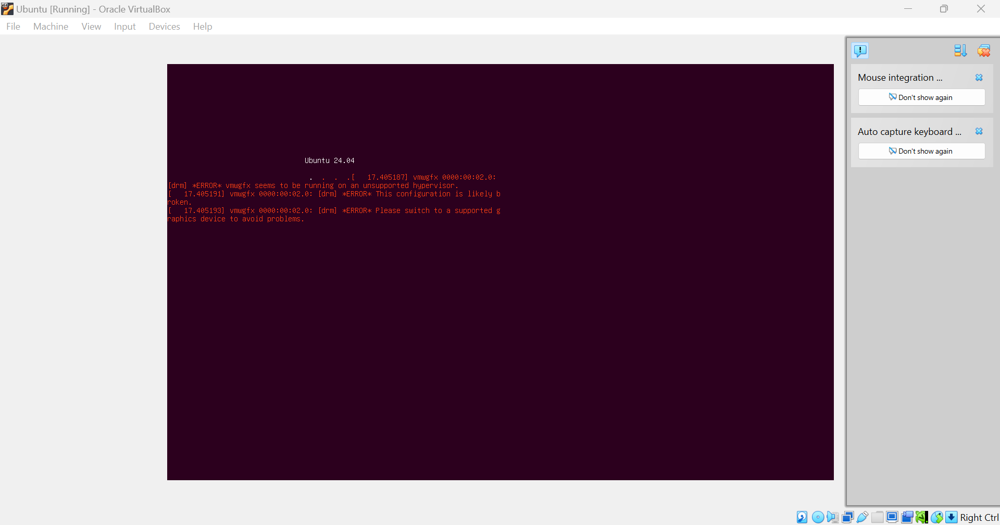
### Error Solved (Problem Solved):
. Go to Setting > change the display graphic in VBoxVGA .
.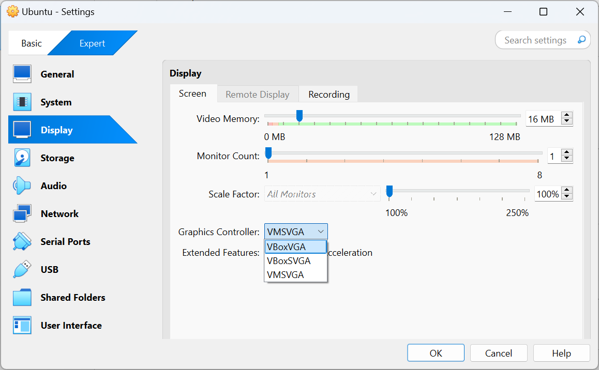

### Day - 2 ( Introduction of core component of OS and Basic Command)
1:**first of all today ,learened about Booting.
### What is Booting?
### Ans - Booting is the process of starting a computer and loading the operating system.
### Process of booting
1: The computer's BIOS or UEFI firmware intializes the hardware.

2: The BIOS/UEFI detects the boot device (eg. Hard drive or USB device)

3: The boot loader(eg. Windows boot Manager) is loaded into memory
### Types of booting
### COld boot/Hard BOOT
Starting a Computer froma  powered-off state.
### Warm Booting/Soft booting
. Restarting a computer without powering it off (eg. using the restart option)
### What is Kernel?
 Ans - The Kernel is a computer program that is core of computer's  operating system,Resposible for working with Hardware.
 
 . Example - It is like a Chef working in Kitchen that give you ,your order (output) but you can't see the chef.
 ### Shell ?
 Ans - Shell is a program that provides a way for users to interact with OS.
 ### Types of Shell
 1: Bash = (Most comman shell in linux)
 
 2:Sh = (original Shell)
 
 3:Zsh = (Unix Shell,used in terminal)
 
 4:fish = (it user-friendly from the start)
 
 ### Categories of Shell
 . Command line Shell : is a text based interface where you types commands to tell the computer to what to do by using keyboard'
 
 . Graphics Shell: ia user interface where you interact with computer using picture,icons,menu by using mouse.
 
### File System Structures
|Name      |    Features
_ _ _ _ _ _ _ _ _ _ _ _ _ _ _ _ _ _ _ _ _ _ _ _ _ _ _ _ _ _ _ _ _ _ _ _ _ _ _ _ _ _ _ _ _ _ _ 
| /        |  The slash / character denotes the root of the file system tree. (trunk of tree) |
 
| /home    |   contain all the personal directories of user|
 
| /bin     |   directories contains user executable file| 
 
| /lib     |   contain shell libraries|
 
| /boot    |   contain all the file that required for booting|
 
| /dev     |   contain hardware and development file|
 
| /media   |   mount points for remove media|

 |/mnt     |   temporary mounted filesystem
 
  |/opt     |   contain optional file|
 
| /var     |   contain variable data |
 ### Commands  
 ls (list) : contents of folder in which it runs
 
 pwd : print the current working dictionary
 
 touch : create file without content
 
 cat : create a file with content 
 
 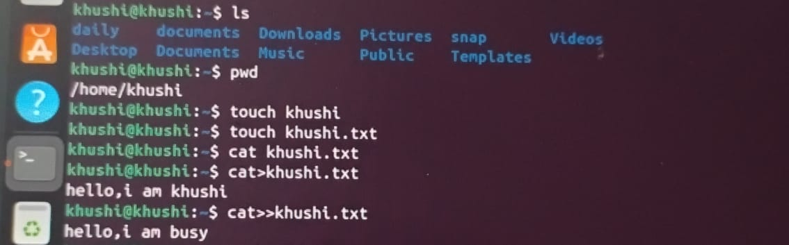
 cd : create a dictionary
 
 echo : print a text
 cp : copies of file from one location to other
 
 nano : edit the file from command line
 
 date : return current date
 
whoami :  return the current domain and user name
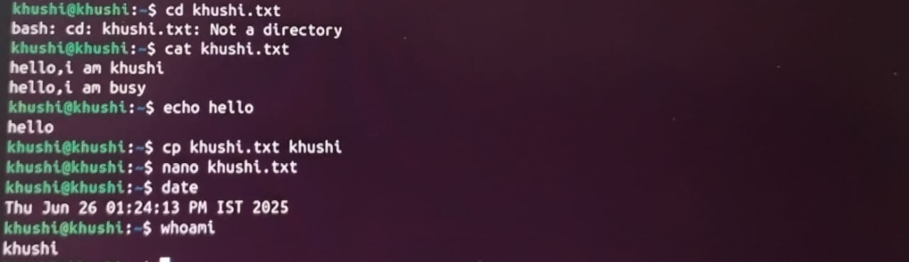
 whereis : find the location of file

 whatis : give short description of a command
 
 mkdir : make dictionary
 
 rmdir : remove dictionary
 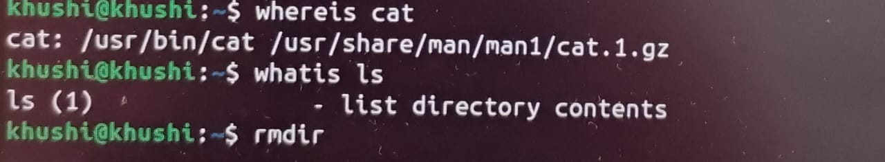

 ### DAY - 3
### Bare Metal installation 

1 Bare metal installation directly using USB (pen drive)

2. Direct installation in ccomputer hardware

### Partitioning schemes
1. divide a Hard Disk into separate division.

2. Each Section acts like a independent disk.

### Types
     /   \
    (MBR) (GBT)     
|______________________|      |GUID Partition table|

| Older,Used with BIOS|      |Support 128 + Partition|     

|Less flexible|              |MOre  flexible |      

|supports upto 2 TB|         |Newer Used with UEFI| 

|Max 4 Primary Partition|    |Works with disks>2 TB |                   

### File and Dictionary Permission
       |___________|
       |  Users    |
       |___________|
       /      |     \
    Owner    Group   Other

       |____________|            
       | Permission |
       |____________|            
       /     |       \
    read   Write     Execute

 ### Types of command
. change mod (chmod): To change the file permission.
ge b
. Syntax - chmod + x filename.sh (give permission to run the script)

. chmod 444: chmod 444 myself.sh  ( permission to read only for everywhere)
. 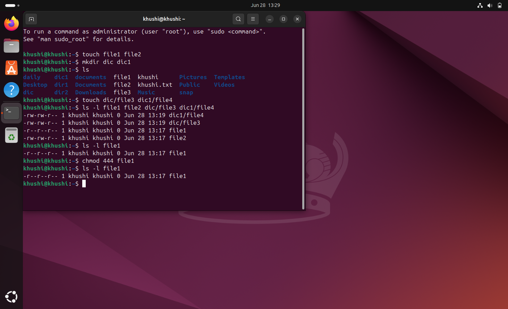

. chmod 644 (Permission to only owner)

 2. chown: (Change the owner and group owner of file directories)

. Syntax: chown user:group file .txt
. 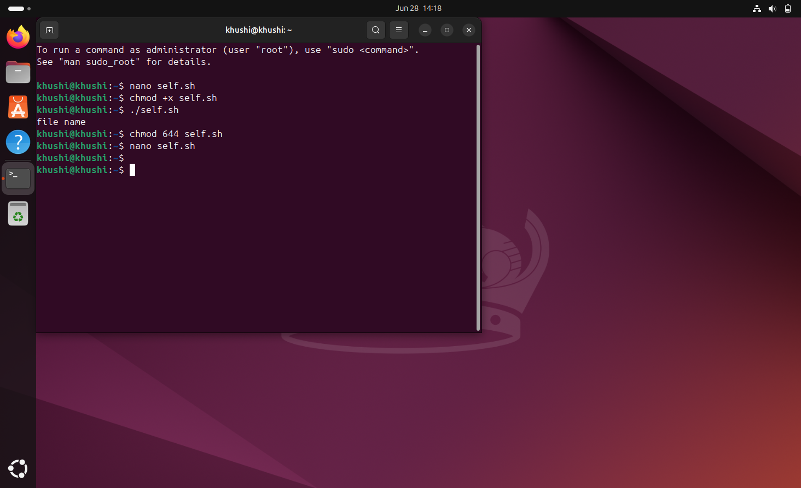

. Result 
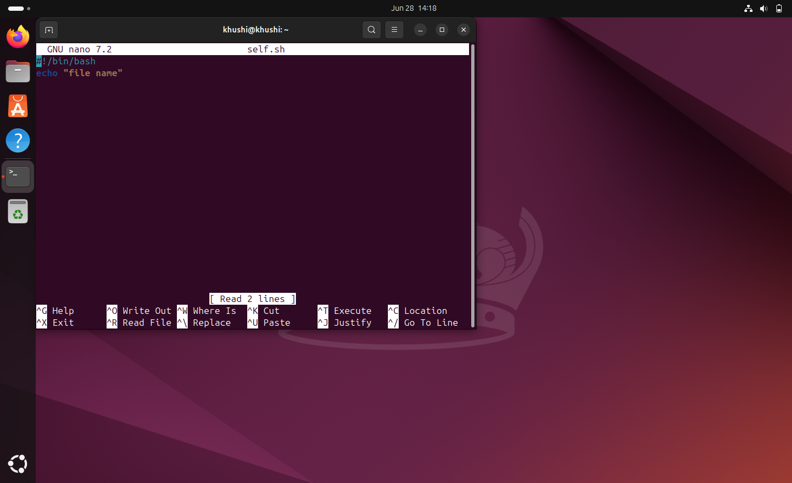

. Permission: only the root and the current owner change the ownership using owner. change the group assoiciated with file and dictionary.

### Redirection
. Allow you to change input or ouput of command.

. Echo hello > day3.txt

. Redirect the message from hello to day3.txt 

. Operations - >(standard  output), >> < (standard input)

### Pipes
. Take output from one command and pass it to another command.

. Particular file in folder.

. Example: You have many fies in folder but you want only file that ends with .sh

### Types 

. pipes are two types

1 unnamed pipes - created using pipe()

2. Named pipes - special file created with mkfifo and can be used for releated communication

### Shell Program

1. Use of Variable

 input
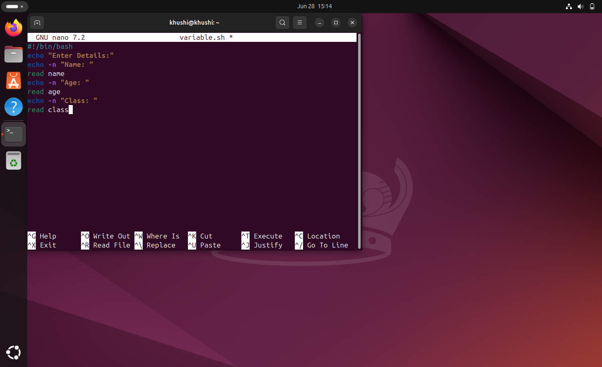

output
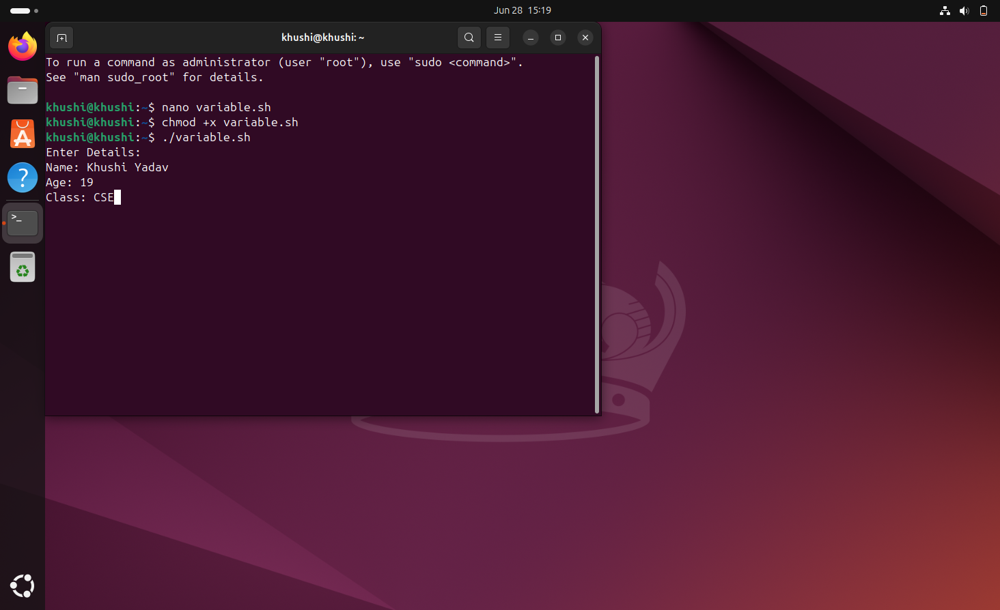

 ### Multiplication of any number

. input
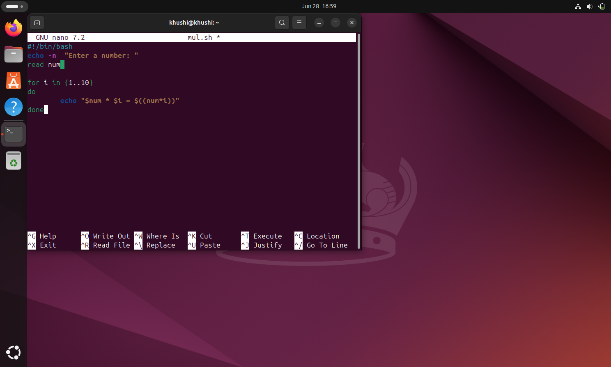

. Output
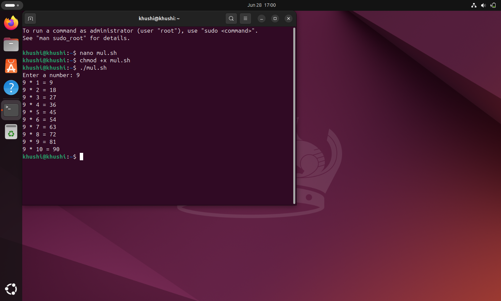

### Comparision of two numbers

. input
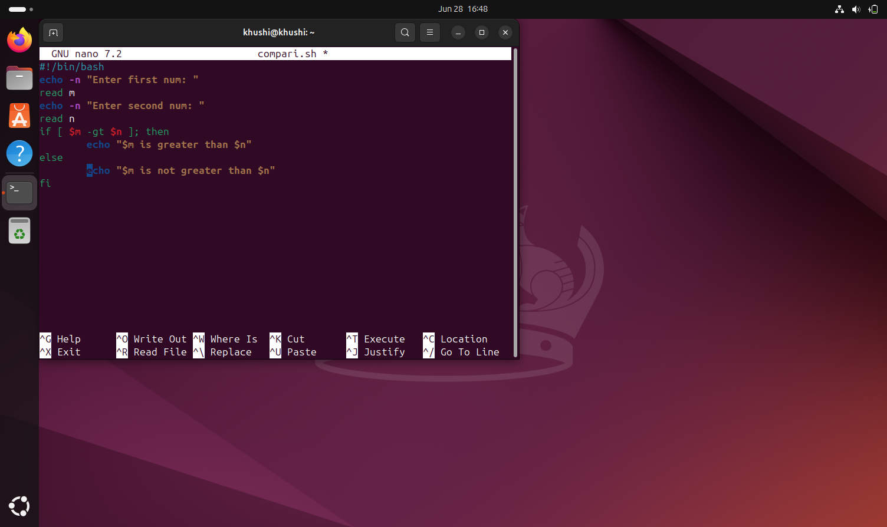

. Output
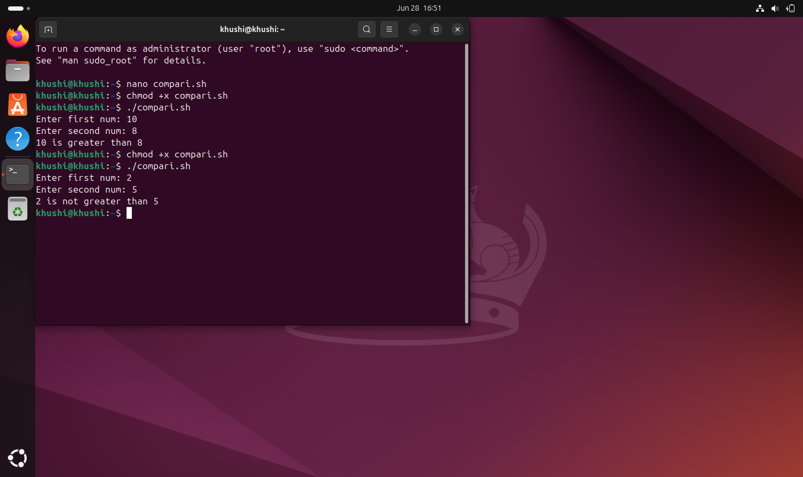

### DAY - 4 

### File Compression Through Command

File compression is the process of reducing the size of a file or group of files by encoding the data more efficiently. This is done to save storage space, reduce transmission time over the internet, and make file management easier.

### Key Points:
### Purpose

. Save Storage space: Save space, speed up file transfer, or organize multiple files.

 . Faster Transmission: Smaller files transfer more quickly over networs , reducing upload and download times.

### GZIP (GNU Zip)

. GZip is a tool that makes files smaller so they take up less space and are faster to send or download,without reducing its size without losing any data.. It creates files with a .gz ending and is mostly used on Linux system.

Syntax: gzip filename.txt

. This command will compress and Creates a new file filename.txt.gz and deletes the original filename . 
### Decompress a file:

. To decompose the file, can use  gunzip command which is equivalent.

. gunzip filename.txt.gz

This will decompose the file  remove the .gz extension, restoring the original file.

### Keep the original file

. To compress the file and keep the original ,use -k option.

. gzip -k file.txt

. This will create a file without without deleting the original file.

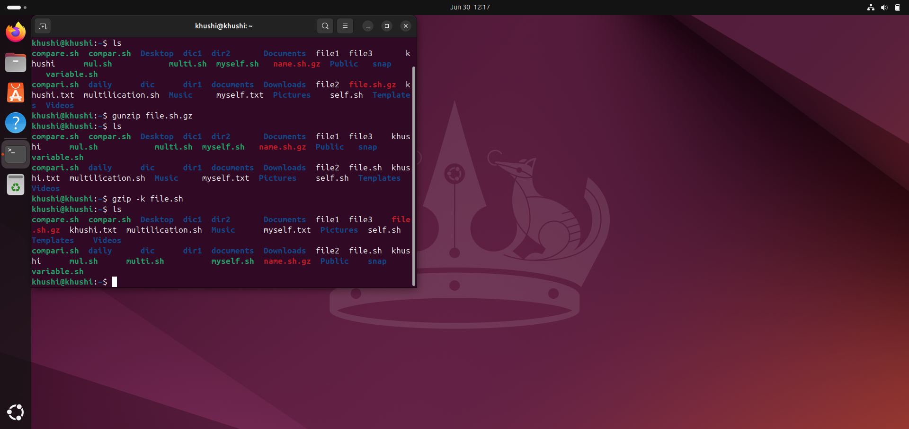

### Wildcards

🔹 Definition of Wildcards:
Wildcards in Linux are special characters used in the command line to represent one or more characters in filenames or directory names. They allow users to work with multiple files at once without typing each name individually.

🔹 Example:  ls *.txt

✅ Common Commands with Wildcards
rm *.log               # Remove all .log files

cp *.jpg images/       # Copy all jpg files to images folder

mv report?.txt old/    # Move report1.txt, report2.txt, etc., to old

| Wildcard  | Description                              | Example          |
| --------- | ---------------------------------------- | ---------------- |
| `*`       | Zero or more characters                  | `*.txt`          |
| `?`       | Exactly one character                    | `file?.txt`      |
| `[...]`   | Any one character from set/range         | `file[1-3].txt`  |
| `[!...]`  | Any one character **not** in set         | `file[!0-9].txt` |
| `{a,b,c}` | Matches any listed string (brace expand) | `file{1,2}.txt`  |
| `{1..5}`  | Range expansion                          | `file{1..5}.txt` |

### Asssignment (Question)

### Escaping Character in linux (Shell)

In Linux, escaping characters means preventing the shell from interpreting special characters. This is essential when dealing with wildcards, variables, spaces, quotes, and other symbols.

###  Why Escape Characters?
Because the shell interprets certain characters specially:

*, ?, |, &, <, >, $, ", ', \, etc.

Escaping tells the shell: "Treat this as a literal character, not a command or pattern.

### Comman Escape Method

| Escape Method | Effect                           | Example                       |
| ------------- | -------------------------------- | ----------------------------- |
| `\`           | Escapes next character           | `echo \$HOME` → `$HOME`       |
| `'...'`       | Everything literal               | `'*.txt'` → `*.txt`           |
| `"..."`       | Allows vars, escapes most others | `"Hello $USER"`               |
| `\` (newline) | Continue command on next line    | `echo "Hello \` → next line\` |

### Example

🔹 1. Escaping a Space in a Filename

. touch MyFile.txt 

ls MyFile.txt       

🔹 2. Escaping a Dollar Sign ($)

. echo \$HOME     

### Quoting in linux

Quoting in Linux (specifically in the shell, like bash) is essential for controlling how the shell interprets special characters like spaces, $, *, &, etc. There are three main types of quoting

1. Single Quotes (')

Purpose: Preserves the literal value of every character inside the quotes.

Example: input

echo 'This is $HOME and $(ls)' 

output : This is $HOME and $(ls)

2. Double Quotes (")

Purpose: Preserves most characters literally except $, `, \, and ! (in some shells).

3. Backslash (\)

Purpose: Escapes a single character, telling the shell to treat it literally.

Input : echo \$HOME

Output: $HOME

### Practical Comperission

| Expression            | What it does                   |
| --------------------- | ------------------------------ |
| `'Hello $USER'`       | Prints literal string          |
| `"Hello $USER"`       | Expands variable               |
| `echo Hello\ World`   | Escapes the space character    |
| `echo "Files: $(ls)"` | Substitutes the output of `ls` |

### Hardware
### Defination: Hardware refers to the physical components of a computer or any electronic system. These are the tangible parts you can touch and see, as opposed to software, which consists of programs and data.

### What is Computer Hardware?

It includes everything from the central processing unit (CPU) inside the computer to the monitor, keyboard, mouse, and storage devices.

Essentially, computer hardware is the machinery that runs software and lets you interact with the computer.

### Basic computer Hardware Components

| Component                   | What It Does                                                    |
| --------------------------- | --------------------------------------------------------------- |
| **CPU (Processor)**         | The brain of the computer, processes instructions and data      |
| **Motherboard**             | The main circuit board connecting all components                |
| **RAM (Memory)**            | Temporary storage that the CPU uses to quickly access data      |
| **Hard Drive / SSD**        | Long-term storage for files, programs, and the operating system |
| **Power Supply Unit (PSU)** | Converts electricity to power the computer                      |
| **Input Devices**           | Devices like keyboard, mouse, scanner used to input data        |
| **Output Devices**          | Devices like monitor, printer used to display or produce output |
| **Graphics Card (GPU)**     | Handles images, video, and graphics processing                  |

### Motherboard

### What is a Motherboard?

. It’s a large flat board inside the computer that connects and allows communication between all the other hardware components.

. It holds the CPU, memory (RAM), storage connections, and expansion cards.

. It also provides connectors for input/output devices like USB ports, audio jacks, and network cables.

### Key Functions of a Motherboard:

. Connects all parts: CPU, RAM, hard drives, graphics card, and other devices.

. Distributes power: Supplies power to different components via the power supply.

. Communication hub: Allows different parts to communicate and work together.

. Expansion slots: Lets you add extra components like graphic cards or sound cards.

### Components on a Motherboard:

1 CPU Socket:

The slot where the processor (CPU) is installed.

It connects the CPU to the rest of the system.

2 RAM Slots (Memory Slots):

Slots where RAM (memory) modules are inserted.

These provide the computer with fast, temporary memory.

3 Chipset:

Controls communication between the CPU, RAM, storage devices, and peripherals.

Often divided into Northbridge (handles high-speed devices like CPU and RAM) and Southbridge (handles slower peripherals like USB, audio).

4 Power Connectors:

Connect the motherboard to the power supply unit (PSU) to provide power.

Usually includes a large 24-pin connector and additional CPU power connectors.

5 PCI / PCI Express (PCIe) Slots:

Expansion slots for adding hardware like graphics cards, sound cards, or network cards.

6 Storage Connectors (SATA Ports):

Connectors for hard drives (HDDs), solid-state drives (SSDs), and optical drives.

7 BIOS / UEFI Chip: 

Firmware chip that helps start the computer and manage hardware before the operating system loads.

8 Input/Output (I/O) Ports:

External connectors on the back of the motherboard for devices like:

9 USB devices:

Ethernet (network) cables

Audio jacks

Video outputs (HDMI, DisplayPort)

CMOS Battery

A small battery that powers the motherboard’s memory for BIOS settings even when the computer is off.

### Power Supply in Hardware

A power supply unit (PSU) is a crucial hardware component that provides electrical power to other components in an electronic system or computer.

### Key Functions:

1. Convert AC to DC: Most hardware devices run on DC power, but the wall outlet provides AC. The PSU converts this AC power into stable DC voltages.

2. Regulate Voltage: It ensures the voltage is constant and within safe limits for the hardware.

3. Distribute Power: Supplies different voltages (e.g., +12V, +5V, +3.3V) to various hardware components like the CPU, motherboard, drives, 

### Cache Memory:

Cache memory is a small, high-speed memory located close to or inside the CPU (Central Processing Unit). It stores frequently used data and instructions so the CPU can access them faster than fetching from the main RAM (which is slower in comparison).

🔍 Why Cache Memory is Important: 

. CPU is much faster than RAM — so if the CPU had to wait for data from RAM every time, it would slow down.

. Cache stores recently used or frequently accessed data.

. Reduces latency and increases processing speed.

⚙️ How It Works :
. CPU requests data.

. Checks L1 → if found, this is a cache hit (very fast).

. If not in L1, checks L2, then L3.

. If not in any cache → fetches from main RAM (slowest — cache miss).

. Once fetched, data is stored in the cache for future use.

### Difference between Cache and RAM memory

| Feature            | **Cache Memory**                                                     | **RAM (Main Memory)**                        |
| ------------------ | -------------------------------------------------------------------- | -------------------------------------------- |
| **Location**       | Inside or very close to the CPU                                      | On the motherboard, connected to the CPU     |
| **Speed**          | Extremely fast (faster than RAM)                                     | Fast, but slower than cache                  |
| **Size**           | Very small (KBs to tens of MBs)                                      | Much larger (GBs)                            |
| **Cost per MB**    | High                                                                 | Lower                                        |
| **Type of Memory** | SRAM (Static RAM)                                                    | DRAM (Dynamic RAM)                           |
| **Purpose**        | Temporarily stores frequently accessed data/instructions for the CPU | Stores all active programs and data in use   |
| **Access by CPU**  | Direct and automatic                                                 | Requires memory controller to access         |
| **Volatility**     | Volatile (data lost when power is off)                               | Volatile (same)                              |
| **Managed by**     | Hardware (CPU decides what goes in cache)                            | Operating System (allocates RAM to programs) |
| **Example Size**   | L1: 64 KB, L2: 512 KB, L3: 8 MB                                      | 4 GB, 8 GB, 16 GB, etc.                      |

 ### Difference between RAM and Harddisk

 | Feature         | **RAM (Random Access Memory)**                                    | **Hard Disk (HDD/SSD)**                                             |
| --------------- | ----------------------------------------------------------------- | ------------------------------------------------------------------- |
| **Function**    | Temporary memory used by the system to run programs and processes | Permanent storage for files, applications, and the operating system |
| **Volatility**  | Volatile – data is lost when the computer is turned off           | Non-volatile – data remains even when the power is off              |
| **Speed**       | Very fast (nanoseconds)                                           | Slower (milliseconds), though SSDs are faster than HDDs             |
| **Capacity**    | Typically 4GB to 64GB (depends on usage)                          | Typically 256GB to several terabytes                                |
| **Usage**       | Acts as a workspace for the CPU to process data                   | Stores data long-term, like documents, software, and system files   |
| **Cost per GB** | More expensive                                                    | Less expensive                                                      |
  
### DAY - 5

### Comman Issues and problems in pc and their Solutions.

🎮 What Is a GPU?
A GPU is responsible for rendering images, video, and animations. It’s essential for gaming, video editing, 3D rendering, and sometimes AI/machine learning tasks.

⚠️ Common GPU Problems and Issues
1. No Display / Black Screen
Causes:

Improper GPU seating in the PCIe slot

Faulty GPU or power supply

Dead HDMI/DisplayPort cable

Solutions:

Reseat the GPU

Try a different output port or cable

Test on another monitor

2. Screen Artifacts / Glitches
Causes:

Overheating

Overclocking gone wrong

Driver or VRAM issues

Solutions:

Revert overclock settings

Clean dust from GPU

Update or reinstall GPU drivers

3. Driver Crashes / “Display Driver Stopped Responding”
Causes:

Incompatible or outdated drivers

System instability

Solutions:

Use DDU (Display Driver Uninstaller) to remove old drivers

Reinstall the latest drivers from NVIDIA, AMD, or Intel

 ### PCU
 🎮 What Is a GPU?
A GPU is responsible for rendering images, video, and animations. It’s essential for gaming, video editing, 3D rendering, and sometimes AI/machine learning tasks.

⚠️ Common GPU Problems and Issues
1. No Display / Black Screen
Causes:

Improper GPU seating in the PCIe slot

Faulty GPU or power supply

Dead HDMI/DisplayPort cable

Solutions:

Reseat the GPU

Try a different output port or cable

Test on another monitor

2. Screen Artifacts / Glitches
Causes:

Overheating

Overclocking gone wrong

Driver or VRAM issues

Solutions:

Revert overclock settings

Clean dust from GPU

Update or reinstall GPU drivers

3. Driver Crashes / “Display Driver Stopped Responding”
Causes:

Incompatible or outdated drivers

System instability

Solutions:

Use DDU (Display Driver Uninstaller) to remove old driver.

### PCU (Personal Computer Unit)

A Personal Computer Unit refers to the complete physical system of a computer, which includes all the essential hardware components needed to process data, run software, and perform computing tasks for individual users.

### Installation & Hard Disk Preparation:
Partitioning: The first step of Partitinong is to organize the hard disk into:

Primary (C: Drive):Where the Operating System (Windows/Linux/Unix) is installed.

Avoid storing personal/important files in C:
If Windows crashes, files in D:, E:, F: are safer and can often be recovered.

Logical Drives (D:, E:, F:): Used for pictures, videos, documents, etc.

Speed slow (Causes & Fixes):
Desktop: Files should be on drive. By default files on desktop are stored on C drive. As OS system is installed in C: file, its recomended to not put many folders in Desktop. Move them into drives.

-Taskbar: keep taskbar clean . close the apps which are not in use.

-Bookmarks: Booksmarks also slows down the speed . because system keep running them in background .

-Temporary files : The files that get created by default during web browsing are temporary files . These can also be the cause of slower performance.

while web browsing some websites ask permmision to accept cookies by which these temporary files are created.

-Malvares : keep your system updated and scan for viruses every month atleast.

### Concept of Optimisation:
Optimization means making something as good, efficient, or effective as possible.

In the computer world, it often refers to:

Speeding up software or hardware so it runs faster or uses fewer resources

-Improving algorithms to solve problems more efficiently

-Reducing energy use in devices or systems

Defragmentation is the process of reorganizing fragmented data on a hard disk so that related pieces are stored close together. This improves file access speed and overall system performance on traditional HDDs. It’s not needed for SSDs, which use a different method called TRIM.

DRIVERS:
Drivers are software that let the operating system communicate with hardware like printers, keyboards, or graphics cards. Without them, hardware won’t work properly.

ISSUES FACED WHILE USING PRINTER:
Here’s a compact list of common printer issues and how to fix them:

🖨️ Common Printer Issues & Solutions
1. Printer Not Printing
Possible Causes:

Printer not set as default

Print queue stuck

Connectivity issue (USB/Wi-Fi)

Solutions:

Set as default printer (Settings > Devices > Printers)

Restart the Print Spooler service:

Run → services.msc → Print Spooler → Restart

Cancel all print jobs and try again

Reconnect printer (USB/Wi-Fi) or restart router

2. Printer Offline / Not Detected
Possible Causes:

Disconnected cable or unstable Wi-Fi

Power saving mode

Incorrect printer port

Solutions:

Reconnect or replace USB/Wi-Fi cable

Restart both PC and printer

Uncheck “Use Printer Offline” in printer settings

Update or reinstall printer drivers

3. Paper Jam
Possible Causes:

Misaligned or overloaded paper tray

Torn or crumpled paper

Solutions:

Open all access doors and gently remove jammed paper

Check for tiny pieces stuck inside

Reload paper properly and align guides

4. Poor Print Quality
Symptoms:

Streaks, faded text, blurry or smudged prints

Solutions:

Clean print heads (via printer software)

Align cartridges

Replace low or dried-out ink/toner

Use correct paper type and print settings

Blue Screen of Death (BSOD):
It is used to indicate a system crash, in which the operating system reaches a critical condition where it can no longer operate safely.

Common Causes of BSOD:

Hardware Failures:
Faulty RAM, hard disk, or other internal components
Driver Issues:
Outdated, incompatible, or corrupted device drivers
Corrupted System Files:
System file corruption due to improper shutdowns, malware, or failed updates
Overheating or Power Issues:
Inadequate cooling or power supply malfunctions
System Crash Analysis:
After a BSOD, Windows creates a dump file that records what happened before the crash.

Tools for Analysis:
Event Viewer:
Windows tool to check detailed system and crash logs.
WinDbg:
Microsoft Debugging Tool for analyzing dump files |
BIOS/UEFI Settings and POST Errors:
|BIOS	                     |  UEFI                                   |
|------------------------------------------------------------------- |
|Basic Input/Output System | 	Unified Extensible Firmware Interface  |

|Older firmware standard   |	 Modern replacement for BIOS            |

|Keyboard-only navigation 	| Supports mouse and GUI                  |

|Stored in ROM chip       	| Stored in flash memory                  |

### Accessing BIOS/UEFI Settings
Press F2, F10, DEL, or ESC continously during startup (key depends on manufacturer).

From here, you can:

Change boot order

Enable/disable hardware components

View system info

Reset settings to default (if needed)

